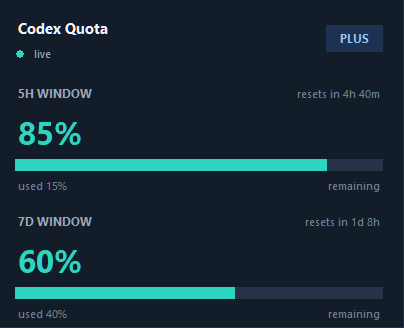

# Codex Quota Overlay for Windows

[English](README.md) | [繁體中文](README_zh.md)

這是一個 Windows 桌面小工具，用來顯示 OpenAI Codex / ChatGPT 的 quota 使用狀態。

它會讀取本機 Codex OAuth token，也就是 `%USERPROFILE%\.codex\auth.json`，呼叫 ChatGPT usage endpoint，然後用小型 Tkinter 浮窗顯示 5 小時與 7 天 rolling quota。



## 這版更新

- 優先使用 `https://chatgpt.com/backend-api/wham/usage`。
- `https://chatgpt.com/backend-api/codex/usage` 改為備援。
- User-Agent 改為 `codex-cli`，避免新版 Codex usage endpoint 在某些請求指紋下回傳 `403`。
- 狀態顯示更清楚，例如 `blocked 403`、`timeout`、`login missing`、`network error`。
- 如果更新失敗，會保留上一筆成功讀到的 quota，不會整個變成空白。
- 本機診斷訊息會寫入 `codex_quota_overlay.log`。
- 上一筆成功讀取結果會快取在 `codex_quota_overlay_cache.json`。
- 視窗改成較大的卡片版面，底部不會被截掉。

## 功能

- 即時顯示 5 小時與 7 天 quota。
- 依剩餘比例用綠色、黃色、紅色顯示。
- 每 30 秒自動更新。
- 右鍵選單支援重新整理、永遠置頂、開啟 log 資料夾、關閉。
- 不需要第三方 Python 套件。
- Windows 原生小浮窗，不需要瀏覽器或 Electron。

## 需求

- Windows 10 或 Windows 11。
- Python 3.9+，需包含 Tkinter。
- Codex Desktop 或 Codex CLI 已用 ChatGPT 登入。

## 快速開始

1. 確認 Codex 已安裝並登入。
2. 雙擊 `launch.vbs`。
3. 在小工具上按右鍵可開啟選單。

## 手動執行

```powershell
python codex_quota_overlay.py
```

不顯示 console 視窗：

```powershell
pythonw codex_quota_overlay.py
```

## 運作方式

```text
%USERPROFILE%\.codex\auth.json
        -> access token
        -> chatgpt.com/backend-api/wham/usage
        -> rate_limit JSON
        -> Tkinter overlay
```

API 回傳格式大致如下：

```json
{
  "plan_type": "plus",
  "rate_limit": {
    "allowed": true,
    "limit_reached": false,
    "primary_window": {
      "used_percent": 35,
      "limit_window_seconds": 18000,
      "reset_at": 1781022613
    },
    "secondary_window": {
      "used_percent": 28,
      "limit_window_seconds": 604800,
      "reset_at": 1781188385
    }
  }
}
```

## 隱私

- access token 只會從本機 Codex auth 檔讀取，並只送到 `chatgpt.com` 查詢 usage。
- 專案內不包含 token、帳號 email、個人路徑或 quota 快照。
- log 與 cache 等執行期間產生的檔案已加入 Git 忽略清單。

## 授權

MIT
